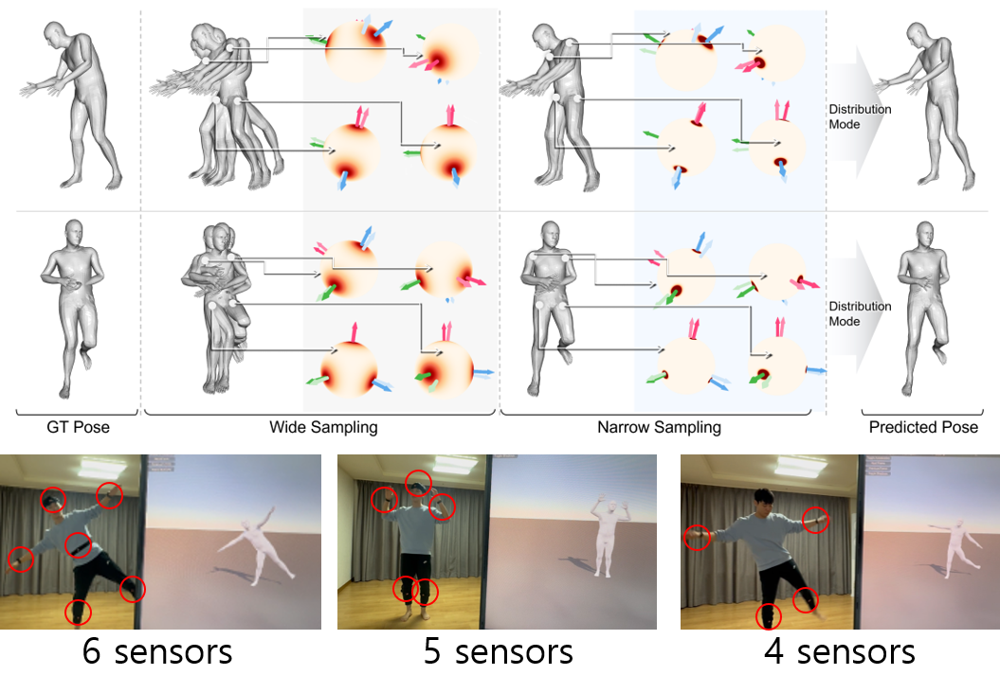

<div align="center">
  <h1 align="center">Probabilistic Inertial Poser (ProbIP)</h1>
  <h3 align="center">Uncertainty-aware Human Motion Modeling from Sparse Inertial Sensors</h3>
  <p align="center">
    
  </p>
  <p align="center">
    Official PyTorch implementation for the paper "Probabilistic Inertial Poser (ProbIP): Uncertainty-aware Human Motion Modeling from Sparse Inertial Sensors" (ICCV 2025).
  </p>
  <p align="center">
    <b>Authors:</b> <a href="https://minkim.io">Min Kim</a>, Younho Jeon, Sungho Jo
  </p>
</div>

## 🧭 Overview

**ProbIP** is a novel probabilistic human motion estimation framework designed to work with sparse inertial measurements (e.g., from 6 IMUs).  
Unlike existing methods that rely on physical priors or heuristics, ProbIP directly models uncertainty in motion prediction through probabilistic representations, enabling robust and accurate full-body motion reconstruction, even under sparse sensor configurations.

Our model not only predicts full-body pose sequences but also captures and quantifies uncertainty in the motion predictions, essential for real-world deployment in interactive environments.

🎥 Check out qualitative video results in `submission/videos/`

---

## 🔬 Key Features

- **RU-Mamba Blocks**: We introduce *Rotation-Uncertainty Mamba (RU-Mamba)*, a novel sequence model block that outputs a matrix Fisher distribution over rotation matrices, capturing both motion and its uncertainty.

- **PDN (Progressive Distribution Narrowing)**: A unique mechanism that gradually refines the motion distribution across layers to stabilize training and improve prediction quality across diverse motion types.

- **Sensor Efficient**: Achieves SOTA results with just **6 IMUs**, and remains competitive with fewer sensors, ideal for real-world applications with hardware constraints.
---

## 📊 Experimental Highlights

- Achieves state-of-the-art accuracy on multiple public datasets with only 6 IMUs.
- Robust to sensor dropout and reduced sensor scenarios.
- Outperforms existing physically-constrained models in both accuracy and uncertainty modeling.

---

## ⚙️ Setup Instructions

### 1. Environment Setup

We recommend using `conda` to manage your environment:

```bash
conda create -n probip python=3.10
conda activate probip
```

Then install PyTorch appropriate for your system and CUDA version:  
👉 https://pytorch.org/get-started/locally/

Next, install the remaining dependencies:

```bash
pip install -r requirements.txt
```

> ⚠️ **Note on `chumpy`:**  
If you encounter a `numpy`-related error when installing `chumpy`, comment out the following line in `site-packages/chumpy/__init__.py`:

```python
# from numpy import bool, int, float, complex, object, unicode, str, nan, inf
```

---

### 2. SMPL Body Models

ProbIP uses SMPL models to reconstruct 3D body mesh.

1. Register and download `.pkl` files from the official [SMPL website](https://smpl.is.tue.mpg.de).
2. Place them under the `smpl_model/` directory:

```
smpl_model/
├── smpl_male.pkl
├── smpl_female.pkl
└── smpl_neutral.pkl
```

---

### 3. Dataset Preparation 📦

ProbIP uses multiple publicly available inertial motion datasets originally introduced in [DynaIP](https://github.com/dx118/dynaip). Please download the following:

- [AnDy Dataset](https://zenodo.org/records/3254403) (`xsens_mvnx.zip`)
- [UNIPD](https://doi.org/10.17605/OSF.IO/YJ9Q4) (Use `.mvnx` files in `single_person/`)
- [EmoKine](https://zenodo.org/records/7821844)
- [CIP](https://doi.org/10.5281/zenodo.5801928) (`MTwAwinda.zip`)
- [Virginia Natural Motion](https://doi.org/10.7294/2v3w-sb92)
- [DIP-IMU](https://dip.is.tue.mpg.de)

Organize your downloaded data as follows:

```
datasets/
├── raw/
│   ├── andy/
│   ├── cip/
│   ├── dip/
│   ├── emokine/
│   ├── unipd/
│   └── virginia/
├── extract/
└── work/
```

Then update the dataset paths in `utils/config.py` accordingly.

To preprocess the raw data:

```bash
python dataset/process.py
```

---

## 🏋️‍♂️ Training

To train ProbIP from scratch, run:

```bash
python train.py
```

Training behavior and parameters are configured via `utils/config.py`.

---

## 🧪 Evaluation

To evaluate a trained model:

```bash
python eval.py
```

You can use our pretrained model weights (download below) or your own checkpoint.

---

## 📥 Pretrained Weights

We provide pretrained weights for quick evaluation and reproducibility:  
🔗 [Download ProbIP Pretrained Weights](https://drive.google.com/drive/folders/1fgxAYPysJ4RMMP-ni1D3Hj2w4kCPdMoO?usp=drive_link)

After downloading, place them under:

```
model_log/
└── best_modeln.pth
```

Then update your evaluation config accordingly.

---

## 🧠 Acknowledgements

This repository is built upon prior foundational works in motion modeling and shape estimation.  
We would like to acknowledge:

- [DynaIP](https://github.com/dx118/dynaip) for their dataset preparation and IMU processing pipeline.  
- [SMPL](https://smpl.is.tue.mpg.de) for the 3D human body model.  
- **Hierarchical Kinematic Probability Distributions for 3D Human Shape and Pose Estimation from Images in the Wild**, ICCV 2021.  
  Read the paper here: https://openaccess.thecvf.com/content/ICCV2021/papers/Sengupta_Hierarchical_Kinematic_Probability_Distributions_for_3D_Human_Shape_and_Pose_ICCV_2021_paper.pdf

---

Feel free to open issues or contribute!  
Let’s build better motion models together 🤝

